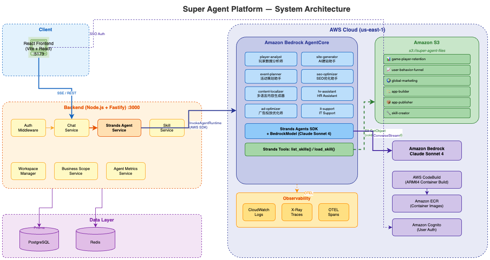

# Super Agent on AWS Running on Amazon Bedrock Agentcore 

Fork from https://github.com/vorale/super-agent


# Super Agent — Architecture & Developer Guide

[](../LICENSE)
[](https://www.typescriptlang.org/)

## Business Overview

Super Agent is an enterprise-grade multi-tenant AI agent platform. It transforms business knowledge (SOPs, documents, best practices) into autonomous virtual employees that can execute tasks, collaborate through workflows, and continuously improve through memory mechanisms.

### Core Value Proposition

| Value | Description |
|-------|-------------|
| SOP-Driven Automation | Import existing SOP documents or describe processes in natural language → system auto-generates agents and workflows |
| Low Implementation Cost | Nodes use natural language intent (e.g., "Create opportunity in CRM") instead of manual API configuration |
| Self-Evolving Intelligence | Agents accumulate experience via Memory mechanism, autonomously optimizing decisions over time |
| Chat as Mini-SaaS | Generate internal applications through conversation, publish to enterprise app marketplace |

### Target Users

- **Business Users** — Create and manage agents without coding; define workflows via natural language
- **IT Administrators** — Configure integrations, manage multi-tenant access, monitor observability
- **Developers** — Extend capabilities via Skills, MCP connectors, and OpenAPI specs

---

## Use Case Examples

### 1. Customer Service Automation

```
Business Scope: Customer Support
├── Agent: Ticket Classifier    → Reads incoming tickets, categorizes by urgency/type
├── Agent: FAQ Responder        → Answers common questions using knowledge base
├── Agent: Escalation Handler   → Routes complex issues to human agents
└── Workflow: Support Pipeline  → Classifier → FAQ check → Auto-reply or Escalate
```

A support team imports their FAQ documents and escalation SOP into a Business Scope. The system generates three specialized agents. A workflow chains them: incoming tickets are classified, matched against the knowledge base, and either auto-replied or escalated — all triggered via Webhook from the ticketing system.

### 2. Marketing Campaign Orchestration

```
Business Scope: Global Marketing
├── Agent: Content Localizer    → Generates multi-language marketing copy
├── Agent: Ad Optimizer         → Analyzes ad performance, suggests budget reallocation
├── Agent: Campaign Reporter    → Generates weekly performance briefings
└── Workflow: Campaign Cycle    → Schedule-triggered weekly analysis → report generation
```

The marketing team connects their ad platform via OpenAPI Spec (auto-converted to Skills). A scheduled workflow runs weekly: the Ad Optimizer analyzes performance data, the Content Localizer generates localized copy for underperforming regions, and the Campaign Reporter compiles a briefing sent via Slack.

### 3. HR Onboarding Pipeline

```
Business Scope: Human Resources
├── Agent: HR Assistant         → Answers policy questions, generates offer letters
├── Agent: IT Provisioner       → Creates accounts, assigns permissions via MCP tools
└── Workflow: New Hire Setup    → Webhook trigger (from HRIS) → IT provisioning → Welcome message
```

When a new hire record is created in the HRIS, a Webhook triggers the onboarding workflow. The IT Provisioner agent creates email accounts and system access via MCP connectors (Jira, Slack, etc.), while the HR Assistant sends a personalized welcome message with policy documents from the knowledge base.

---

## Architecture Overview

```
┌─────────────────────────────────────────────────────────────────────┐
│                        AWS Cloud (CDK-managed)                      │
│                                                                     │
│  ┌──────────────┐    ┌──────────────────────────────────────────┐  │
│  │  CloudFront   │───▶│  S3 (Frontend Static Assets)             │  │
│  │  Distribution │    └──────────────────────────────────────────┘  │
│  │               │    ┌──────────────────────────────────────────┐  │
│  │  /api/* ──────│───▶│  ALB → ECS Fargate (Backend)             │  │
│  │  /ws/*  ──────│───▶│  Node.js + Fastify :3000                 │  │
│  └──────────────┘    └────────┬──────────┬──────────┬────────────┘  │
│                               │          │          │               │
│                    ┌──────────▼┐  ┌──────▼───┐  ┌──▼────────────┐  │
│                    │  Aurora    │  │  ElastiC. │  │  Amazon       │  │
│                    │  Postgres  │  │  Redis    │  │  Bedrock      │  │
│                    │  v2        │  │           │  │  (Claude)     │  │
│                    └───────────┘  └──────────┘  └───────────────┘  │
│                                                                     │
│  ┌──────────┐  ┌──────────┐  ┌──────────┐  ┌───────────────────┐  │
│  │ S3 Files │  │ S3 Avatar│  │ Cognito  │  │ Langfuse          │  │
│  │ (docs,   │  │ (images) │  │ (Auth)   │  │ (Observability)   │  │
│  │  skills) │  │          │  │          │  │                   │  │
│  └──────────┘  └──────────┘  └──────────┘  └───────────────────┘  │
└─────────────────────────────────────────────────────────────────────┘
```

### Infrastructure (AWS CDK)

| Component | Service | Purpose |
|-----------|---------|---------|
| Compute | ECS Fargate (ARM64, 1 vCPU / 2 GB) | Backend API server |
| Database | Aurora PostgreSQL Serverless v2 (0.5–4 ACU) | Business data persistence |
| Cache/Queue | ElastiCache Redis (cache.t4g.micro) | BullMQ job queues, caching |
| CDN | CloudFront | Frontend SPA hosting, API/WS reverse proxy |
| Storage | S3 × 3 buckets | Frontend assets, files/skills, avatars |
| Auth | Cognito User Pool | SSO, JWT authentication |
| AI | Amazon Bedrock | Claude Sonnet 4 model inference |
| Observability | Langfuse, CloudWatch | Tracing, logging, AI observability |

### Network Topology

CloudFront serves as the single entry point:
- `/` → S3 frontend bucket (SPA with fallback to `index.html`)
- `/api/*` → ALB → ECS Fargate backend
- `/ws/*` → ALB → ECS Fargate WebSocket
- `/docs*` → ALB → Swagger UI
- `/health` → ALB → Health check endpoint

Security groups enforce strict access: ALB → ECS (port 3000), ECS → Aurora (5432), ECS → Redis (6379).

---

## Backend Architecture

### Tech Stack

Fastify + TypeScript + Prisma ORM + PostgreSQL + Redis (BullMQ)

### Layered Structure

```
backend/src/
├── index.ts                    # Entry point
├── app.ts                      # Fastify app builder (plugins, hooks, shutdown)
├── config/                     # Environment config, database, queue config
├── middleware/                  # Auth (JWT/Cognito), error handler, request logger, scope access
├── authorization/              # RBAC permissions, auth middleware
├── routes/                     # 30+ route modules (REST API endpoints)
├── schemas/                    # Zod validation schemas
├── repositories/               # Prisma data access layer
├── services/                   # Business logic layer
│   ├── chat.service.ts         # Session management, SSE streaming
│   ├── strands-agent.service.ts # AgentCore Runtime / Bedrock integration
│   ├── claude-agent.service.ts # Claude Agent SDK session management
│   ├── workspace-manager.ts    # Per-session workspace isolation
│   ├── workflow-orchestrator.ts # DAG execution engine
│   ├── workflow-execution.service.ts
│   ├── workflow-generator.service.ts # AI-powered workflow generation
│   ├── mcp.service.ts          # Model Context Protocol integration
│   ├── langfuse.service.ts     # Observability tracing
│   ├── skill.service.ts        # Skill loading from S3
│   ├── skill-marketplace.service.ts
│   ├── webhook.service.ts      # Webhook trigger management
│   ├── schedule.service.ts     # Cron-based scheduling
│   ├── briefing-generator.service.ts # AI-generated scope briefings
│   ├── agent.service.ts        # Agent CRUD + configuration
│   ├── businessScope.service.ts # Multi-tenant scope management
│   ├── organization.service.ts # Org management
│   ├── document.service.ts     # RAG document management
│   ├── im.service.ts           # IM channel routing
│   ├── *-adapter.ts            # Slack, Discord, Telegram, DingTalk, Feishu adapters
│   └── node-executors/         # Workflow node type executors
│       ├── agent-executor.ts
│       ├── action-executor.ts
│       ├── condition-executor.ts
│       ├── document-executor.ts
│       ├── code-artifact-executor.ts
│       ├── human-approval-executor.ts
│       └── pass-through-executor.ts
├── websocket/                  # WebSocket gateway for real-time workflow events
├── setup/                      # Event bridge, queue initialization, schedule processor
├── types/                      # TypeScript type definitions
└── utils/                      # Claude config, workflow graph, SSE helpers
```

### API Routes

| Prefix | Module | Description |
|--------|--------|-------------|
| `/health` | health | Health check (no auth) |
| `/api/auth` | auth | Authentication endpoints |
| `/api/agents` | agents | Agent CRUD, avatar, workshop |
| `/api/tasks` | tasks | Task management |
| `/api/workflows` | workflows | Workflow CRUD, versioning |
| `/api/executions` | execution | Workflow execution, real-time status |
| `/api/documents` | documents | Document upload, RAG indexing |
| `/api/files` | files | S3 file storage, presigned URLs |
| `/api/chat` | chat | Chat sessions, SSE streaming |
| `/api/mcp` | mcp | MCP server configuration |
| `/api/organizations` | organizations | Org management, memberships |
| `/api/business-scopes` | businessScopes | Scope CRUD, integrations, memory, IM channels |
| `/api/skills` | skills, marketplace, enterprise | Skill management, marketplace browse/install |
| `/api/apps` | apps, appData | Published apps, app marketplace |
| `/api/im` | im | IM webhook receivers (Slack, Discord, etc.) |
| `/openapi/v1` | openapi | Public API (API Key auth) |

### Data Model (Key Entities)

```
organizations
  ├── memberships (user ↔ org, roles)
  ├── business_scopes
  │     ├── scope_memberships (scope-level RBAC)
  │     ├── scope_memories (persistent knowledge)
  │     ├── scope_briefings (AI-generated insights)
  │     ├── agents
  │     │     └── agent_skills (many-to-many)
  │     ├── workflows
  │     │     ├── workflow_executions
  │     │     ├── workflow_schedules
  │     │     └── webhooks
  │     ├── chat_sessions
  │     │     └── chat_messages
  │     ├── published_apps
  │     ├── im_channel_bindings
  │     └── scope_mcp_servers
  ├── skills (S3-backed, versioned)
  ├── skill_marketplace (shared catalog)
  ├── documents (RAG knowledge base)
  ├── api_keys (programmatic access)
  └── mcp_servers (MCP tool connectors)
```

### Key Flows

**Chat Flow:**
1. Client → `POST /api/chat/sessions/:id/stream`
2. Auth middleware validates JWT/Cognito token
3. Chat service loads Business Scope context (agents, skills, knowledge, MCP tools)
4. Workspace Manager creates isolated session workspace
5. Strands Agent Service invokes Amazon Bedrock (Claude) with full context
6. Response streams back via SSE, messages persisted to PostgreSQL
7. Agent metrics recorded, Langfuse trace captured

**Workflow Execution Flow:**
1. Trigger (manual / webhook / cron schedule)
2. Workflow Orchestrator resolves DAG, topologically sorts nodes
3. BullMQ queues node execution jobs
4. Node executors run per type (Agent, Action, Condition, Document, Code, Human Approval)
5. WebSocket gateway broadcasts real-time status updates
6. Execution history persisted with per-node state tracking

---

## Frontend Architecture

### Tech Stack

React 19 + Vite + TypeScript + Tailwind CSS + React Router + XY Flow

### Structure

```
frontend/src/
├── pages/                      # Route-level components
│   ├── Dashboard.tsx           # Overview with stats cards
│   ├── Chat.tsx                # Real-time agent conversation (SSE)
│   ├── WorkflowEditor.tsx      # Visual DAG editor (XY Flow)
│   ├── Agents.tsx              # Agent listing
│   ├── AgentConfigurator.tsx   # Agent creation/editing
│   ├── Tools.tsx               # Skills, MCP, integrations management
│   ├── Marketplace.tsx         # App marketplace
│   ├── AppRunner.tsx           # Run published apps
│   ├── KnowledgeManager.tsx    # Document/knowledge base management
│   ├── CreateBusinessScope.tsx # Scope creation wizard
│   ├── MCPConfigurator.tsx     # MCP server setup
│   ├── TaskExecutionCenter.tsx # Workflow execution monitoring
│   ├── Settings.tsx            # Org settings, members, API keys
│   └── Login.tsx / AuthCallback.tsx
├── components/
│   ├── chat/                   # Chat message rendering, session history
│   ├── canvas/                 # Workflow canvas nodes, edges, toolbar
│   ├── WorkflowCopilot.tsx     # AI-assisted workflow generation
│   ├── AIScopeGenerator.tsx    # AI-powered scope creation
│   ├── SkillsPanel.tsx         # Skill management UI
│   ├── MCPServersPanel.tsx     # MCP configuration UI
│   ├── IMChannelsPanel.tsx     # IM channel binding UI
│   ├── ScopeMemoryPanel.tsx    # Scope memory management
│   ├── SchedulePanel.tsx       # Cron schedule management
│   ├── WebhookPanel.tsx        # Webhook configuration
│   └── ...                     # 40+ UI components
├── services/                   # API clients, state management
│   ├── api/                    # REST client, per-resource service modules
│   ├── chatStreamService.ts    # SSE stream handling
│   ├── workflowWebSocketClient.ts # WebSocket for execution events
│   ├── AuthContext.tsx         # Cognito auth state
│   ├── ChatContext.tsx         # Chat session state
│   └── cognito.ts             # Cognito SDK integration
├── lib/
│   ├── canvas/                 # Workflow canvas utilities, layout algorithms
│   └── workflow-plan/          # AI workflow plan generation & patching
├── i18n/                       # Internationalization (EN/ZH)
└── types/                      # TypeScript interfaces
```

### Key UI Features

| Feature | Implementation |
|---------|---------------|
| Real-time Chat | SSE streaming via `chatStreamService.ts`, multi-turn context |
| Workflow Editor | XY Flow (React Flow) DAG canvas with drag-and-drop nodes |
| Workflow Copilot | Natural language → workflow plan generation, iterative refinement |
| AI Scope Generator | Describe business domain → auto-generate scope with agents, skills, knowledge |
| App Marketplace | Browse, rate, and run published Mini-SaaS apps |
| IM Channel Binding | Configure Slack/Discord/Telegram/DingTalk/Feishu per scope |
| Multi-language | i18n support with EN/ZH translations |

---

## Function Reference

### Agent Management

| Function | Endpoint | Description |
|----------|----------|-------------|
| Create Agent | `POST /api/agents` | Create agent with role, system prompt, model config |
| Update Agent | `PUT /api/agents/:id` | Update agent configuration |
| Delete Agent | `DELETE /api/agents/:id` | Remove agent |
| List Agents | `GET /api/agents` | List agents (filtered by scope) |
| Equip Skill | `POST /api/agents/:id/workshop/equip` | Attach skill to agent |
| Unequip Skill | `DELETE /api/agents/:id/workshop/unequip` | Remove skill from agent |

### Chat

| Function | Endpoint | Description |
|----------|----------|-------------|
| Stream Chat | `POST /api/chat/sessions/:id/stream` | Send message, receive SSE stream |
| List Sessions | `GET /api/chat/sessions` | List chat sessions |
| Get History | `GET /api/chat/sessions/:id/messages` | Retrieve conversation history |
| Delete Session | `DELETE /api/chat/sessions/:id` | Remove session and messages |

### Workflow

| Function | Endpoint | Description |
|----------|----------|-------------|
| Create Workflow | `POST /api/workflows` | Create workflow with DAG definition |
| Execute Workflow | `POST /api/executions/workflows/:id/execute` | Trigger workflow execution |
| Get Execution | `GET /api/executions/:id` | Get execution status and node states |
| Abort Execution | `POST /api/executions/:id/abort` | Cancel running execution |
| WebSocket Events | `WS /ws/executions/:id` | Real-time node status updates |

### Skills & Knowledge

| Function | Endpoint | Description |
|----------|----------|-------------|
| Upload Skill | `POST /api/skills` | Register skill (S3-backed) |
| Browse Marketplace | `GET /api/skills/marketplace` | Search community skills |
| Install Skill | `POST /api/skills/marketplace/install` | Install from marketplace |
| Upload Document | `POST /api/documents` | Upload document for RAG indexing |
| Upload OpenAPI Spec | `POST /api/business-scopes/:id/integrations` | Auto-convert to scope skills |

### Business Scope

| Function | Endpoint | Description |
|----------|----------|-------------|
| Create Scope | `POST /api/business-scopes` | Create isolated business domain |
| AI Generate Scope | `POST /api/scope-generator/generate` | AI-powered scope generation |
| Manage Memory | `GET/POST /api/business-scopes/:id/memories` | Persistent scope knowledge |
| Bind IM Channel | `POST /api/business-scopes/:id/im-channels` | Connect IM platform |
| Get Briefing | `GET /api/business-scopes/:id/briefings` | AI-generated scope insights |

### Integrations

| Function | Endpoint | Description |
|----------|----------|-------------|
| Create Webhook | `POST /api/webhooks` | Create webhook trigger for workflow |
| Trigger Webhook | `POST /api/webhooks/:id/trigger` | External system triggers workflow |
| Create Schedule | `POST /api/schedules` | Cron-based workflow scheduling |
| Configure MCP | `POST /api/mcp/servers` | Add MCP tool connector |
| IM Webhook | `POST /api/im/:platform/webhook` | Receive IM messages (Slack, etc.) |

### Administration

| Function | Endpoint | Description |
|----------|----------|-------------|
| Manage Org | `GET/PUT /api/organizations/:id` | Organization settings |
| Manage Members | `POST/DELETE /api/organizations/:id/members` | Member invitation, role management |
| API Keys | `POST/DELETE /api/organizations/:id/api-keys` | Programmatic access tokens |
| Public API | `POST /openapi/v1/workflows/:id/execute` | API Key-authenticated workflow execution |

---

## External System Integration

### Inbound (Triggering Agents)

```
IM Platforms ──────┐
  Slack            │
  Discord          ├──▶ /api/im/:platform/webhook ──▶ Chat Service ──▶ Agent
  Telegram         │
  DingTalk         │
  Feishu ──────────┘

External Systems ──┐
  CRM              │
  CI/CD            ├──▶ /api/webhooks/:id/trigger ──▶ Workflow Execution
  HRIS             │
  Custom ──────────┘

Cron Schedule ─────────▶ BullMQ ──▶ Workflow Execution

Public API ────────────▶ /openapi/v1/workflows/:id/execute ──▶ Workflow Execution
```

### Outbound (Agents Calling External Systems)

- **OpenAPI Spec → Skills**: Upload Swagger/OpenAPI spec → auto-parsed into callable skills
- **MCP Connectors**: 40+ pre-built connectors (Salesforce, Jira, Slack, etc.) via Model Context Protocol
- **S3 Skills**: Custom skill definitions stored in S3, loaded into agent system prompts

---

## Observability & Audit

| Capability | Implementation |
|------------|---------------|
| AI Trace | Langfuse — full reasoning chain, tool calls, sub-agent delegation per conversation |
| Agent Metrics | Daily aggregated metrics: calls, skill usage, tool invocations, errors |
| Workflow Audit | Per-execution, per-node state tracking (pending → running → completed/failed) |
| Request Tracing | UUID per request, propagated through full call chain |
| Tenant Isolation | All data strictly isolated by `organization_id` |

---

## Development Setup

### Prerequisites

- Node.js ≥ 18, Docker & Docker Compose
- AWS account with Bedrock access (Claude models)

### Quick Start (Local)

```bash
# Backend
cd backend
cp .env.example .env          # Configure environment
docker compose up -d           # Start PostgreSQL + Redis + LocalStack
npm install
npx prisma generate && npx prisma migrate dev
npm run dev                    # http://localhost:3000

# Frontend
cd frontend
cp .env.example .env
npm install
npm run dev                    # http://localhost:5173
```

### Production Deployment (AWS CDK)

```bash
cd infra
npm install
npx cdk deploy                 # Deploys full stack: VPC, Aurora, Redis, ECS, CloudFront, Cognito, S3
```

---

## Architecture Diagram

See [architecture.drawio](./docs/architecture-v2.drawio) — open with [draw.io](https://app.diagrams.net/) or VS Code draw.io extension.



## Example

See [case examples](docs/GLOBAL_MARKETER_TEST_SCENARIOS.md) .


